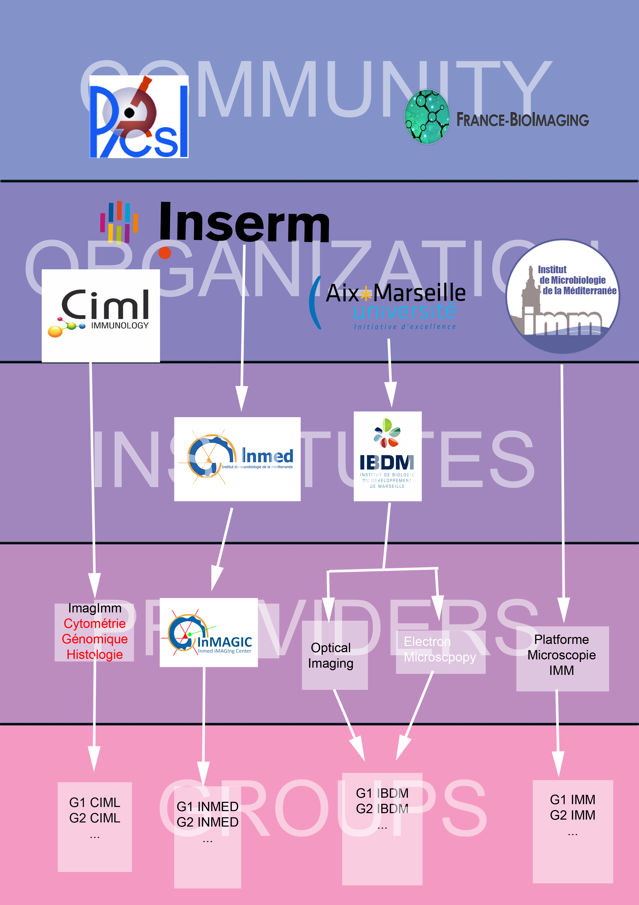

# OpenIRIS-documentation
This a documentation repository for the OpenIRIS users of the PICsL Imaging community. OpenIRIS is a website with an enormous amount of information that offers solutions to most aspects of resource management for microscopy facilities. Browsing through a site like that can be chaotic. This resource aims to accompany members of the community in this endeavour.

At this point the documentation is a set of markdown files. My goal is to create a wiki that could potentially save users and admins time. 

This should include a general plan of the PICsL community ontology in OpenIRIS and a number of tutorials. A lot of helpful information can already be found in the [Helsinki University OpenIRIS wiki](https://wiki.helsinki.fi/display/OpenIRIS/Open+IRIS).

Note that the final product should be in English and French to accomodate the entire community.

## PICsL arboresence in OpenIRIS

The structures that currently participate in PICsL are the following: [IBDM Light Microscopy Facility](http://www.ibdm.univ-mrs.fr/service/imaging/), [IBDM Electron Microscopy Facility](http://www.ibdm.univ-mrs.fr/service/microscopy/), [INMED InMaGIC](https://www.inmed.fr/inmagic-plateforme-imagerie), [IMM Microscopy Facility](https://www.imm.cnrs.fr/spip?lang=fr) and [CIML ImagImm Facility](http://www.ciml.univ-mrs.fr/technology/imagimm-0).

Integrating these facilities into OpenIRIS also meant integrating their perent organizations/institutes. For the sake of clarity from here on we refer to OpenIRIS abstractions in CAPITAL letters and to real life structures in plain text. For example INSTITUT refers to the OpenIRIS abstraction or object and institut to a real life institut such as the IBDM.

A main feature of OpenIRIS is according e-mail extensions to specific ORGANIZATIONS. If an email extension is reserved by a specific ORGANIZATION we cannot vreate another with the same suffix. For example since the users of IBDM use the same e-mail adress as those of Aix-Marseille University(AMU) we cannot create an ORGANIZATION for IBDM. Each institute had a different email suffix and in order to introduce the structures to the site we had to create different abstractions.

Therefore in the scope of OpenIRIS, CIML and IMM are ORGANIZATIONS, IBDM is an INSTITUT affiliated to the ORGANIZATION AMU and INMED is an INSTITUT affiliated to the ORGANIZATION INSERM.

Each of the afforementioned structures is an OpenIRIS PROVIDER affiliated with their parent ORGANIZATION or INSTITUTE.

All structures are proud members of PICsL and France-BioImaging(FBI). We have affiliated our providers to the PICsL and FBI COMMUNITIES.

